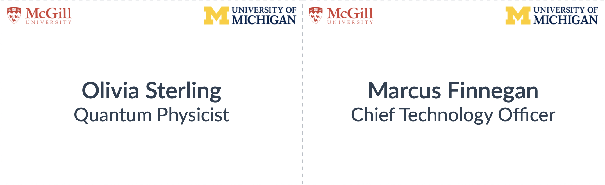
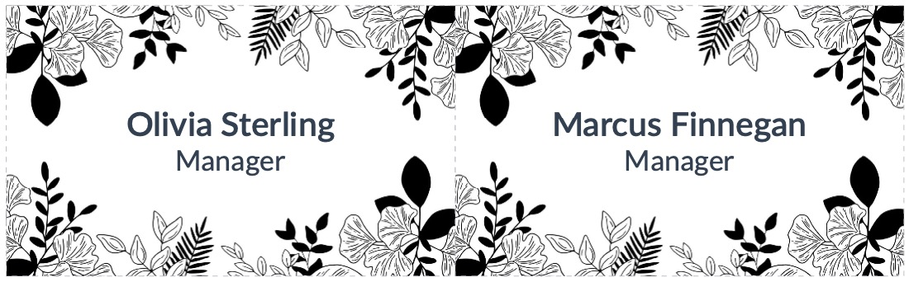
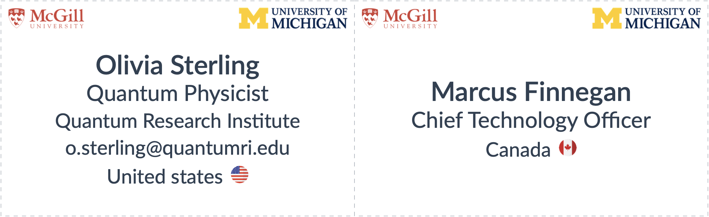

# quarto-typst-nametag

A quarto extension that uses typst to create nametags


## Installation

:warning: Requires quarto 1.4.

```
quarto use template royfrancis/quarto-typst-nametag
```

## Render

```
quarto render index.qmd
```

## Settings

Change YAML metadata in `index.qmd` as needed. All of the settings specified below are optional.

- **info**: Up to five lines of information and an icon for line5. Key must be named line1, line2 etc. All lines are optional.
  - **line1**: A string
  - **line2**: A string
  - **line3**: A string
  - **line4**: A string
  - **line5**: A string
  - **icon**: A path to an image. This image is suffixed to content on line 5
- **logo-left.path**/**logo-right.path**: Path to left or right logo
- **logo-left-height**/**logo-right-height**: Height of left and right logos in mm
- **font-size**: Base font size in pt. Line 1 is 1.2x and line3/line4 are 0.9x.
- **leading**: Spacing between lines in em
- **paper-height**: Height of paper in mm. Defaults to A4
- **paper-width**: Width of paper in mm. Defaults to A4
- **nametag-height**: Height of nametag in mm. Defaults to 55mm
- **nametag-width**: Width of nametag in mm. Defaults to 90mm
- **bg-image**: A background image for the nametag. Preferably use same dimensions as nametag for accurate alignment
- **trim-color**: Color of dashed trim line in hexadecimal
- **text-color**: Color of all text in hexadecimal
- **text-pos-x**: Allows the whole text block to be moved left or right. Defaults to 0mm. Use negative values to move left.
- **text-pos-y**: Allows the whole text block to be moved up or down. Defaults to 0mm. Use negative values to move up.
- **inset**: Margin around content. ie; Distance around content from edges. Defaults to 0.3em
- **icon-size**: Size of the icon image. Defaults to 4.5mm.

## Examples

**Basic usage**

```
---
info:
  - line1: "Olivia Sterling"
    line2: "Quantum Physicist"
  - line1: "Marcus Finnegan"
    line2: "Chief Technology Officer"
format: nametag-typst
---
```


**With logos**

```
---
info:
  - line1: "Olivia Sterling"
    line2: "Quantum Physicist"
  - line1: "Marcus Finnegan"
    line2: "Chief Technology Officer"
logo-left:
  path: "assets/logo1.png"
logo-right:
  path: "assets/logo2.png"
format: nametag-typst
---
```



**With custom background image and fonts**

```
---
info:
  - line1: "Olivia Sterling"
    line2: "Quantum Physicist"
    line3: "Quantum Research Institute"
  - line1: "Marcus Finnegan"
    line2: "Chief Technology Officer"
logo-left:
  path: "assets/logo1.png"
logo-right:
  path: "assets/logo2.png"
bg-image:
  path: assets/abstract.png
format:
  nametag-typst:
    keep-typ: true
    font-paths: fonts
---
```


```
---
info:
  - line1: "Olivia Sterling"
    line2: "Manager"
  - line1: "Marcus Finnegan"
    line2: "Manager"
bg-image:
  path: assets/bg.png
format:
  nametag-typst:
    keep-typ: true
    font-paths: fonts
---
```



```
---
info:
  - line1: "Olivia Sterling"
    line2: "Manager"
  - line1: "Marcus Finnegan"
    line2: "Manager"
bg-image:
  path: assets/abstract-dark.png
text-color: "#d6dbdf"
format:
  nametag-typst:
    keep-typ: true
    font-paths: fonts
---
```


**Using line5 and icon**

```
---
info:
  - line1: "Olivia Sterling"
    line2: "Quantum Physicist"
    line3: "Quantum Research Institute"
    line4: "o.sterling@quantumri.edu"
    line5: "United states"
    icon: "assets/us.png"
  - line1: "Marcus Finnegan"
    line2: "Chief Technology Officer"
    line3: ""
    line5: "Canada"
    icon: "assets/ca.png"
logo-left:
  path: "assets/logo1.png"
logo-right:
  path: "assets/logo2.png"
format:
  nametag-typst:
    keep-typ: false
    font-paths: fonts
---
```



---

2025 • Roy Francis
